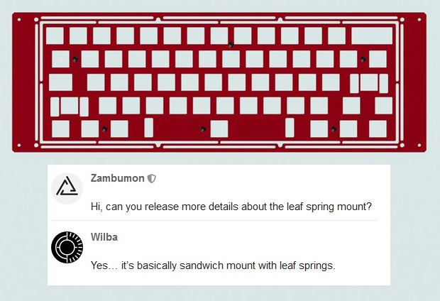

# 常见键盘结构

原链接：[分享一下影响打字音的键盘结构及 DP-64 调教心得 by raykcy](https://www.zfrontier.com/app/flow/19818)

键盘结构最直接影响打字音，设计五花八门，以下几种设计比较常见：

来源：国外大神 Thomas Baart, Brian Lee

**Tray mount (托盘结构)**：螺丝从定位板正面結合底壳空心部位的螺丝柱及PCB三者。大众向的60%至68% 一般使用这种结构，外壳、PCB及定位板同配列大多能通用。容易设计及制造但螺丝柱会**令区域手感软硬不一，并影响打字音统一性**。例如：Ducky One 2 Mini系列、Tofu系列、Tada系列、GH60系列、**DP-64**。

**Top mount (上壳结构)**：直接翻译的话就是上壳式安装，螺丝从定位板背面结合上壳，底壳再结合上壳。能统一手感及打字音，国内及海外大部分高端团购使用这种结构的比例占多。例如：Matrix Lab产品线、Gray Studio产品线、Cannon Keys Savage65、Cannon Keys Satisfaction 75 (还有太多不能尽录)。

**Bottom mount (底壳结构)**：直接翻译的话就是底壳式安装，螺丝从定位板正面结合底壳，底壳再结合上壳。也能较为统一手感及打字音。例如：Percent Studio Canoe Gen1、KBD67v1、KBD8Xv1 (而KBD的v2都改为Top mount了)。

**Sandwich mount (三明治结构)**：有吃过公司三文治Club Sandwich吗？上壳及底壳是面包，定位板是馅料，而螺丝就是那条牙签了。由于定位板被夹在外壳中间，手感相对较硬，但同时能更好地消除触底的不平衡令打字音更统一。例如：TX Keyboards产品线 (基本上其余做Sandwich Mount 的都加上各种垫片成了Gasket Mount)。

**Plateless mount (无钢)**：不使用定位版，PCB直接跟外壳结合，需要使用五脚轴协助定位。打字手感会较为柔软，打字音也比较安静。例如：除了一体定位板之外你想的都能作无钢，Tray mount 以外的结构要特别定制PCB 增加螺丝孔去作固定。

**Integrated plate (一体定位板)**：定位板跟上壳是一体成型的，相对其他结构打字手感会比较硬，并且容易回馈空腔声，但容易生产。例如：RAMA Koyu、RAMA M60-A、老猫Doro67、Tofu HHKB、Tokyo60。

**Gasket mount (垫片结构)**：近期很火的结构，一般使用有弹性的物料垫在定位板及外壳的连接处从而达到缓冲震动的效果。使用此结构的键盘手感能达到刚柔并济的效果，打字音清脆利落。

可以再细分为两类型：

1. 螺丝串起定位板及外壳，垫片通常会安排在螺丝的左右位置，视乎设计师安排体积大小。保留Sandwich Mount的硬度同时缓冲三片硬物接触的震动。例如：Percent Studio Canoe Gen2、Exclusive E6.5、Cannon Keys Chimera。

2. 螺丝只串起外壳，定位板依靠两块外壳的压力夹在中间，一般使用若干数量的长条型垫片以承托打字区域。同样地缓冲三片硬物接触的震动，但由于没有用螺丝固定定位板，手感比起1. 会更软。例如：路易斯Volcano660、ai03 Polaris、TGR x Singa Unikorn。

**Leaf spring mount (板簧结构)**：用定位板作板簧去达到减震及增加柔性的目的，让整个键盘受力均匀，手感统一。例如：wilba.tech Thermal、RAMA M50-A GRID、ai03 7V。

- wilba.tech Thermal 定位板图示及其设计师Wilba 对Leaf spring mount 的解释

