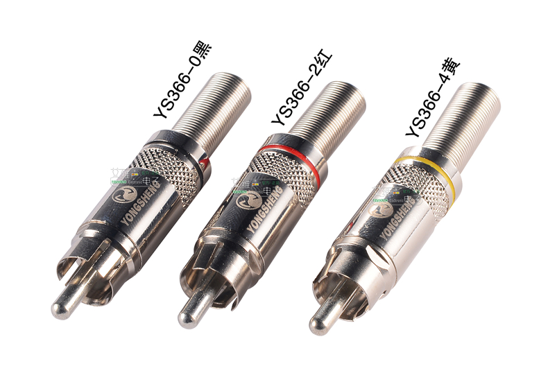

# 键盘线

### 尺寸

**Typec-C**

接口尺寸：8.3x2.5mm

**USB-A型**

接口尺寸：11.5x4.5mm

**莲花头（RCA端子）**

外壳尺寸：8.25mm

### 材料

**6MM热缩管**

**4MM 7芯伞绳**

**乐群甬声 YS366  莲花头RCA音频头AV音视频插头 尾径6mm **

**航空插头插座XS6-2芯3芯4芯5芯 开孔6mm/推拉式/微型连接器快速插**

价格：[￥12](https://detail.tmall.com/item.htm?spm=a230r.1.14.33.5ea964f4wGovMd&id=613685709631&ns=1&abbucket=12&skuId=4323226793381)（插头+插座）

[细节](img/cables/XS6-detail.jpg)

**航空插头座YC8**

价格：[￥11 + 7](https://item.taobao.com/item.htm?spm=a230r.1.14.72.197c6cf0uyuQMC&id=581359307069&ns=1&abbucket=12#detail)（插头+插座）、[￥14](https://item.taobao.com/item.htm?spm=a230r.1.14.53.197c6cf0uyuQMC&id=612849508764&ns=1&abbucket=12#detail)

**航空插头座XS8**

价格：[￥4.8](https://detail.tmall.com/item.htm?spm=a230r.1.14.4.6304326d75r1RK&id=523024935062&ns=1&abbucket=12&skuId=3113884540712)

**航空插头座GX12**

价格：[￥3.5](https://detail.tmall.com/item.htm?spm=a1z10.3-b-s.w4011-18704095228.127.68ff4840pjJW3r&id=522027988597&rn=d6ec61604821e46f9aa5e468016375e8&abbucket=20&skuId=3109423727323)

