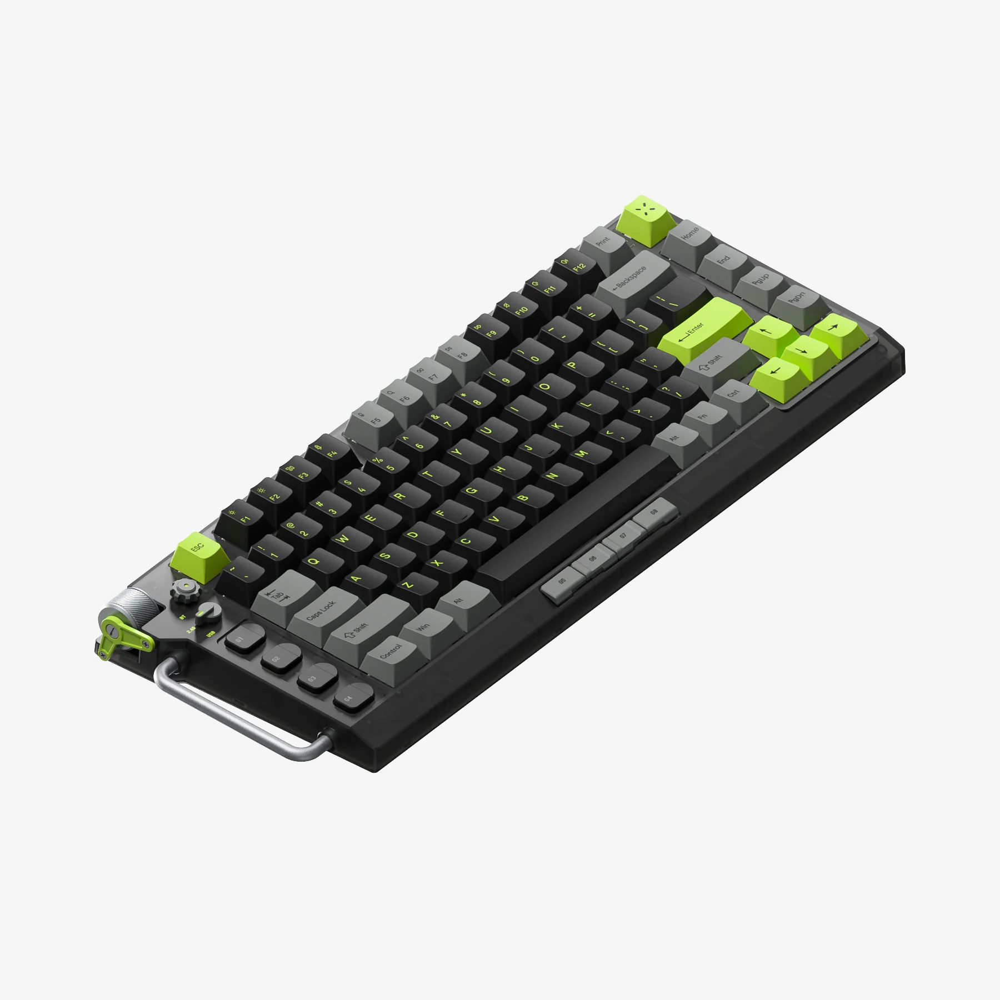
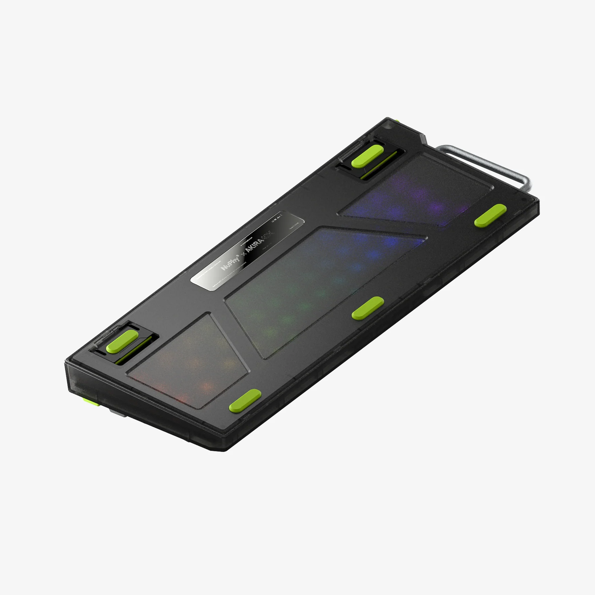
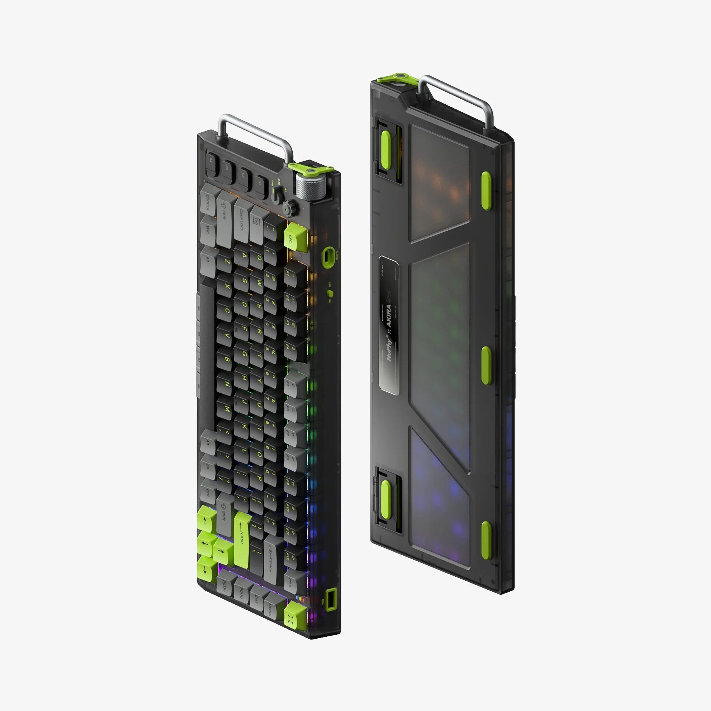
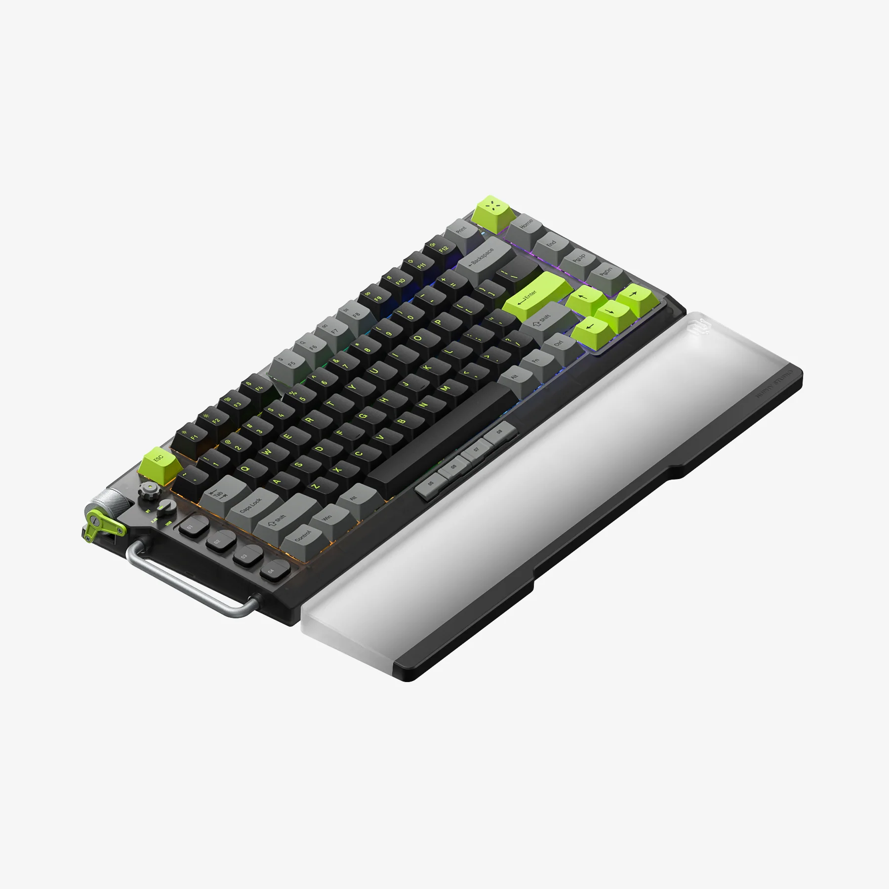
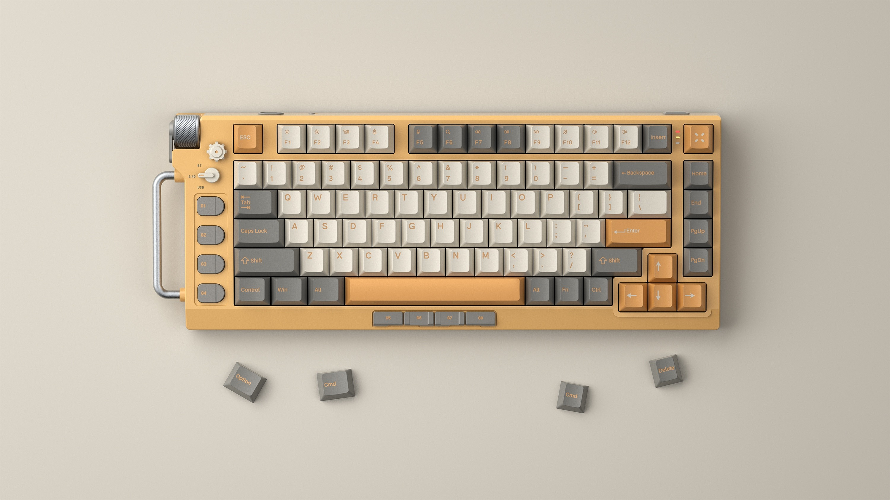
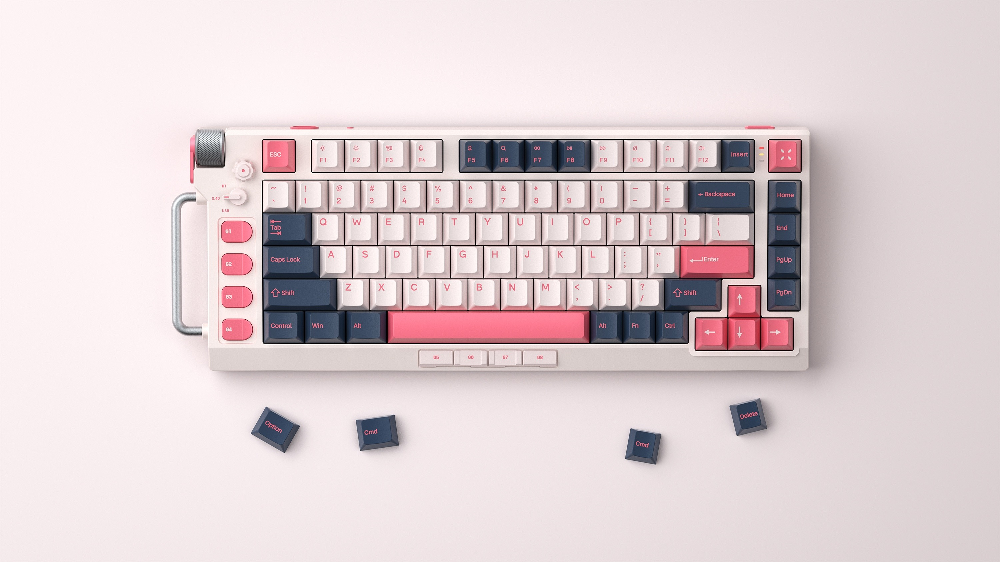
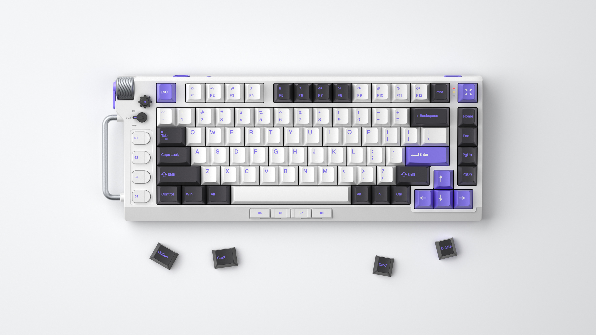
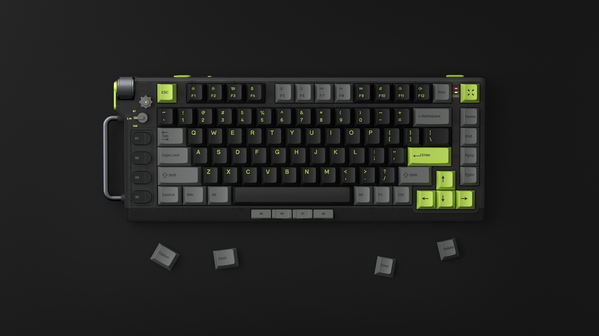

# NuPhy Field75

https://nuphy.com/collections/keyboards/products/field75

NuPhy® x AKIRA40K
**NuPhy Field75**
Wireless Mechanical Gaming Keyboard

## Preview

### Dark Green

### Front Color

## Tech Specs

**GENERAL**

Switch Type: Polaris/Fleeting Gold/Cherry Speed Silver/Cherry Ergo Clear

Layout: ANSI 75%

Number of Keys: 83

Customizable Buttons: 8

Knob: Volume & RGB
Hot-swappable Support: Yes
N-key Rollover Support: Yes

Backlight: RGB-LED

Backlight Modes: 18

Compatible System: macOS/Windows/Android/iOS

Angle: 3.5º/ 8.5º

Operating Environment: -10 to 50℃

 

**CONNECTION**

Mode: 2.4GHz, Bluetooth 5.0 or Wired (USB-C)

2.4GHz Polling Rate: 1000Hz

Bluetooth 5.0 Polling Rate: 125Hz

Wired Polling Rate: 1000Hz

**POWER AND BATTERY**

Battery Capacity: 4200mAh

Working Time (all lights on): 25~42 hours (lab test result)
Working Time (all lights off): Up to 160 hours (lab test result)

 

**MATERIALS**

Case: ABS

Keycap: Double-shot PBT

 

**SIZE AND WEIGHT**

14.66 inches x 5.62 inches x 1.59 inches (372.3 mm x 142.8 mm x 40.4 mm)

2.81 pounds (1276 grams)

 

**DESKMAT SIZE**

35.03 inches x 15.75 inches x 0.157 inch (890 mm x 400 mm x 4 mm)

 

 

# ENDe