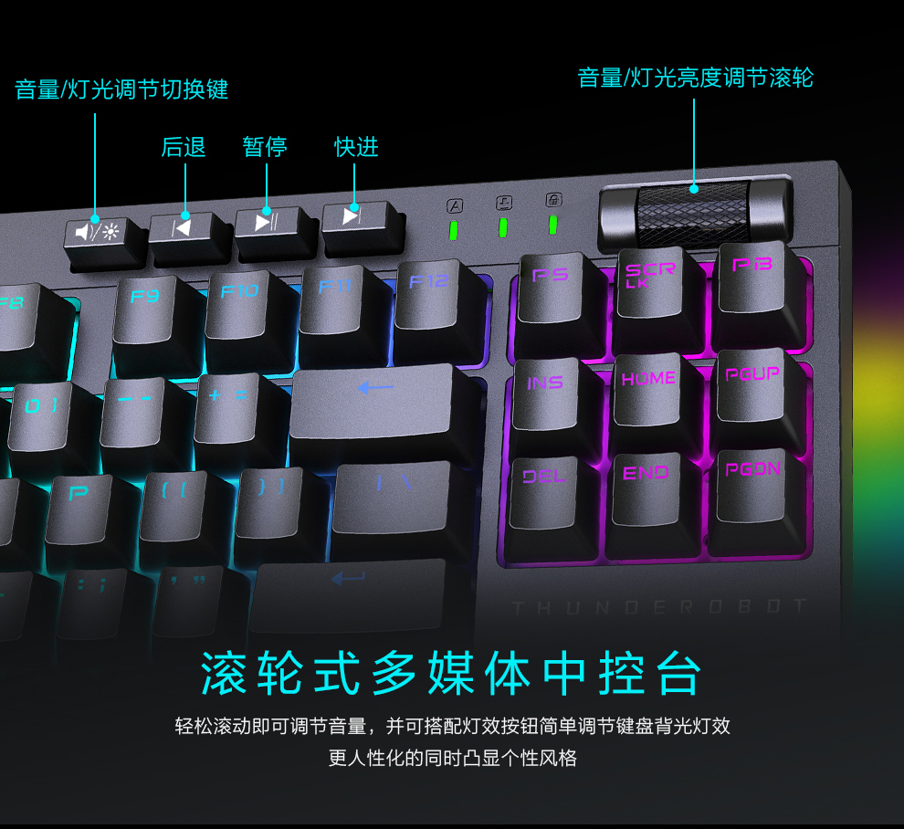

# ThundeRobot 雷神 KL30R 92键 2.4G双模机械键盘

[ThundeRobot 雷神 KL30R 92键 2.4G双模机械键盘 黑色 雷神TR红轴 RGB - 什么值得买](https://wiki.smzdm.com/p/8wxxwmo/)

[【雷神 无线游戏 机械键盘 红轴 KL30R】-京东](https://item.jd.com/100005787518.html)

ThundeRobot 雷神 KL30R 92键 2.4G双模机械键盘

首先，KL30R采用雷神定制TR机械轴，这种轴体类型具有灵敏而稳定的特性，能够提供流畅的按键体验。双注塑工艺PBT材质键帽使得键盘更加耐用，不易磨损和打滑。此外，配备滚轮式多媒体键及5个独立宏按键，使得用户可以轻松控制音乐播放、音量调节等常用功能，提高工作效率。

KL30R支持有线、2.4G无线双模连接方式，用户可以根据自己的需求选择合适的连接方式。内置3000mAh电池，使其能够持续使用长达7天，无需频繁充电。同时，它还自带双接收器，使得连接更加稳定可靠。

92键设计使得KL30R更加紧凑，易于携带和使用。配备碗托的设计使得键盘更加稳固，不易摇晃。支持RGB灯效和两侧流光灯带，使其在黑暗中更加醒目美观。

## Preview

## Preview for JD

## Base

# END